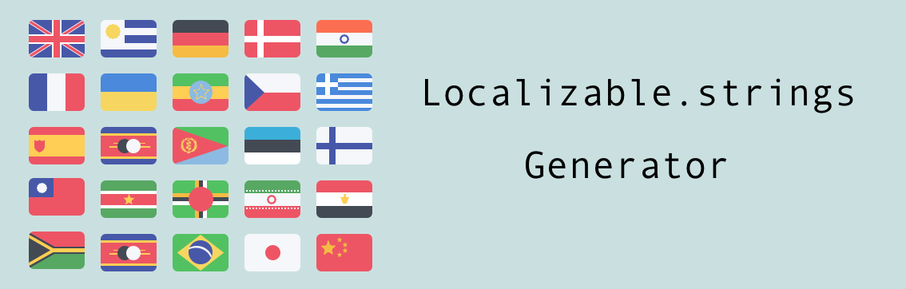
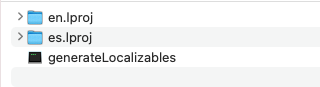
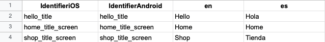

# Localizable.strings files generator

When we want to internationalize our project always is a headache to maintain the `Localizable.strings` files. 

This scripts allows you to download and parse a spreadsheet document form **Google Drive** 

### Installation

Just download the latest [binary](https://github.com/jrescabias/Localizable-Generator/releases) version and include at the Internazionalization folder that you have your `Localizable.strings`. 

### SpreadSheet format

To make the script works we need to define the **spreadsheet** with the following format:

The first **row** need to have those keys

* First colum **IdentifieriOS**
* Second colum **IdentifierAndroid**
* Next colums **country code downcased**

You can add all the languages that you need on the next colums. Just remember to follow this format 😎 

### Make it work

I recomend to create an aggregate target to your project called `Autogenerate` and add a ***New run script phase*** to the `build phases`.

Copy this to the script, add your parameters and build

`"$SRCROOT"/<script path> <spreadsheet URL>`

⚠️ Remember that the spreadsheet's link need to be public.

### Futures updates

- [X] Android support
